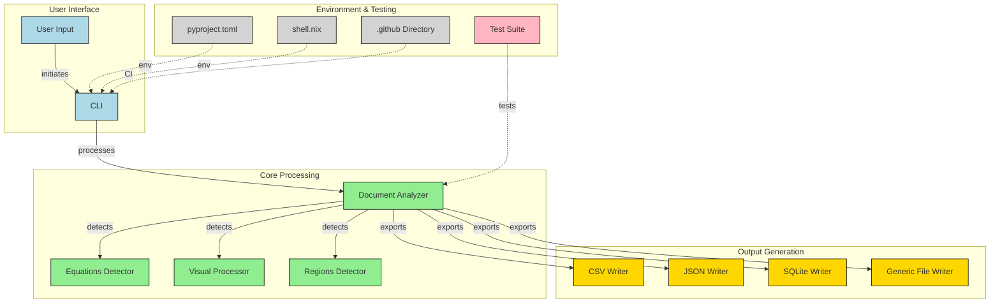

# Docproc

A Python-based document region analyzer and content extraction tool with advanced visual content recognition.

## Overview

Docproc is an opinionated document content analyzer that extracts text, equations, images, and diagrams from documents using modern AI models. It provides both a library interface and a streamlined command-line tool.

## Features

- **Text extraction** with automatic equation detection
- **Visual content recognition** powered by IBM Granite 3.2 vision model
- **Equation to LaTeX** conversion for mathematical content
- **Figure and diagram detection** with detailed descriptions
- **Multiple export formats**: CSV, JSON, and SQLite
- **Batch processing** of multiple documents
- **Local processing** without requiring external APIs

## Repository Flow



## Installation

```bash
# Using pip
pip install docproc
```

## Usage

### As a Command-line Tool

#### Basic Usage

```bash
# Process a single file (default: extract all content types, output as CSV)
docproc document.pdf

# Specify output format
docproc document.pdf -f json
docproc document.pdf -f sqlite

# Specify output file
docproc document.pdf -o results.csv
```

#### Extract Specific Content Types

```bash
# Extract only text and equations
docproc document.pdf -c text equation

# Extract only figures and images
docproc document.pdf -c figure image
```

#### Enable Advanced Visual Recognition

```bash
# Process with advanced visual content detection
docproc document.pdf --visual
```

#### Extract All Data with Full Context

```bash
# Extract all data with complete metadata
docproc document.pdf --extract-all -f json -o complete-data.json
```

#### Batch Processing

```bash
# Process multiple files
docproc --batch --input-dir ./documents --pattern "*.pdf" --output-dir ./results
```

### As a Library

```python
from docproc.doc.analyzer import DocumentAnalyzer
from docproc.writer import CSVWriter

# Using context manager (recommended)
with DocumentAnalyzer(
    "document.pdf",
    writer=CSVWriter,
    output_path="output.csv",
    enable_visual_detection=True
) as analyzer:
    # Extract all data with complete metadata
    data = analyzer.extract_all_data()

    # Or detect regions and process them
    regions = analyzer.detect_regions()
    analyzer.export_regions()
```

## Content Recognition

Docproc can recognize four main types of content:

1. **TEXT**: Regular text content.
2. **EQUATION**: Mathematical equations and formulas (converted to LaTeX).
3. **FIGURE**: Diagrams, charts, and complex visual elements (with descriptions).
4. **IMAGE**: Photos and other non-diagram images.

## Technical Details

The document processing pipeline uses:

- **PyMuPDF** for PDF parsing
- **IBM Granite 3.2** for visual content recognition, running entirely locally
- **OpenCV** for image processing and diagram detection
- **Unicode math detection** for identifying equations in text

## Development

```bash
# Install dependencies
uv sync
```

## Contributing

Pull requests are welcome. Please ensure tests pass before submitting.

## Contact

For any questions, feedback or suggestions, please contact the author @ [hi@rithul.dev](mailto:hi@rithul.dev)
