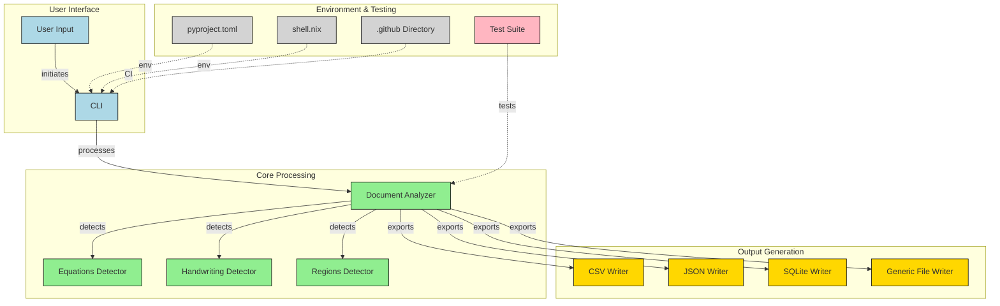

# Docproc

A Python-based document region analyzer and content extraction tool.

> [!WARNING]  
> Project is under active development so most of the features aren't implemented, The readme is written to understand project scope.

## Overview

Docproc is an opinionated document region analyzer that helps extract text, equations, images and handwriting from documents. It provides both a library interface and a command-line tool.

## Repository Flow



This diagram was generated by [GitDiagram](https://gitdiagram.com). A shoutout.

## Installation

```bash
# Using pip
pip install docproc
```

## Usage

### As a Command-line Tool

```bash
# Basic usage
docproc input.pdf

# Specify output format and file
docproc input.pdf -w csv -o output.csv
docproc input.pdf -w sqlite -o database.db
docproc input.pdf -w json -o output.json

# Extract only specific region types
docproc input.pdf --regions text equation
docproc input.pdf -r text image  # Short form

# Enable verbose logging
docproc input.pdf -v
```

Supported output formats:

- CSV (default)
- SQLite
- JSON

### As a Library

```python
from docproc.doc.analyzer import DocumentAnalyzer
from docproc.writer import CSVWriter

# Using context manager (recommended)
with DocumentAnalyzer("input.pdf", CSVWriter, output_path="output.csv") as analyzer:
    regions = analyzer.detect_regions()
    analyzer.export_regions()
```

## Roadmap

The following features are planned for upcoming releases:

- **Handwriting Recognition**: Detect and extract handwritten content from documents

## Development

```bash
uv sync
```

## Contributing

Pull requests are welcome. Please ensure tests pass before submitting.

## Contact

For any questions, feedback or suggestions, please contact the author @ [hi@rithul.dev](mailto:hi@rithul.dev)
