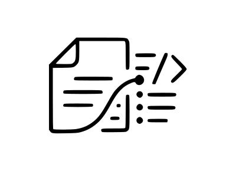

# docproc

<p align="center">
  
</p>

<p align="center">
  <b>docproc</b><br>
  Turn messy documents into clean markdown for AI pipelines.
</p>

<p align="center">
  Document → Markdown → AI
</p>

---

docproc is a document-to-markdown extraction engine. It converts PDFs, DOCX, PPTX, and XLSX into clean structured markdown while preserving equations, figures, and embedded images. It is designed to power LLM pipelines, RAG systems, and document processing workflows.

## Features

- **PDF → Markdown** — Native text extraction plus vision-based handling of embedded images
- **DOCX → Markdown** — Full document structure and formatting
- **PPTX → Markdown** — Slides to structured content
- **XLSX → Markdown** — Spreadsheets to readable tables
- **Equation preservation** — LaTeX and math kept intact (with optional LLM refinement)
- **Figure extraction** — Every image, diagram, and label described by a vision model
- **Clean structured output** — Ready for LLMs, RAG, and downstream pipelines

## Example

**Before:** A PDF with mixed text, equations, and diagrams.

**After:** A single `.md` file with extracted text, LaTeX math blocks, and every figure explained by the vision model—ready to embed, chunk, or feed into an LLM.

```bash
docproc --file paper.pdf -o paper.md
```

## Installation

```bash
pip install git+https://github.com/rithulkamesh/docproc.git
```

Or with [uv](https://github.com/astral-sh/uv):

```bash
uv tool install git+https://github.com/rithulkamesh/docproc.git
```

From source:

```bash
git clone https://github.com/rithulkamesh/docproc.git && cd docproc
uv sync --python 3.12
```

## Usage

One-time config (generates `docproc.yaml` from your `.env`):

```bash
docproc init-config --env .env
```

Extract a document to markdown:

```bash
docproc --file input.pdf -o output.md
```

Optional: `--config path`, `-v` for verbose output. Shell completions: `docproc completions bash` or `docproc completions zsh`.

## Why docproc?

Naive PDF parsers often drop equations, misread layouts, and leave images as black boxes. docproc uses native extractors where possible (PyMuPDF, python-docx, etc.) and runs a vision model on every embedded image—so diagrams, charts, and equations become text or LaTeX that your AI stack can actually use. Optional LLM refinement cleans markdown and normalizes math. The result is document content that fits cleanly into RAG pipelines and LLM context windows instead of noisy, incomplete text.

## Architecture

docproc is **CLI-only**: no server, no database. The pipeline is:

1. **Load** — Read the file (PDF/DOCX/PPTX/XLSX) and extract full text from the native layer.
2. **Vision** — For PDFs, run a vision model on every embedded image; get descriptions, LaTeX, or structured captions.
3. **Refine** (optional) — LLM pass to tidy markdown, normalize LaTeX, and strip boilerplate.
4. **Sanitize** — Dedupe and clean; write a single `.md` file.

Configuration lives in `docproc.yaml` (or generated via `docproc init-config --env .env`). AI providers: OpenAI, Azure, Anthropic, Ollama, LiteLLM. See [docs/ARCHITECTURE.md](docs/ARCHITECTURE.md) and [docs/CONFIGURATION.md](docs/CONFIGURATION.md) for details.

## Demo (docproc // edu)

The [demo/](demo/) is a full study workspace: upload docs, chat over them, generate notes and flashcards, create and take assessments. It’s a separate Go + React app that calls this CLI when a document is uploaded. See [demo/README.md](demo/README.md).

## Docs

| Doc | Description |
|-----|-------------|
| [docs/README.md](docs/README.md) | Index |
| [docs/CONFIGURATION.md](docs/CONFIGURATION.md) | Config schema, providers, ingest, RAG |
| [docs/ARCHITECTURE.md](docs/ARCHITECTURE.md) | Pipeline, CLI vs API |
| [docs/AZURE_SETUP.md](docs/AZURE_SETUP.md) | Azure OpenAI and Vision setup |
| [docs/ASSESSMENTS_AI.md](docs/ASSESSMENTS_AI.md) | Assessments and grading in the demo |

**Environment:** `DOCPROC_CONFIG` for config path (default: `docproc.yaml`). Provider keys: `OPENAI_API_KEY`, `AZURE_OPENAI_*`, `ANTHROPIC_API_KEY`, etc. See [.env.example](.env.example).

## Contributing

Pull requests welcome. Run the tests before sending.

## License

MIT. See [LICENSE.md](LICENSE.md).
