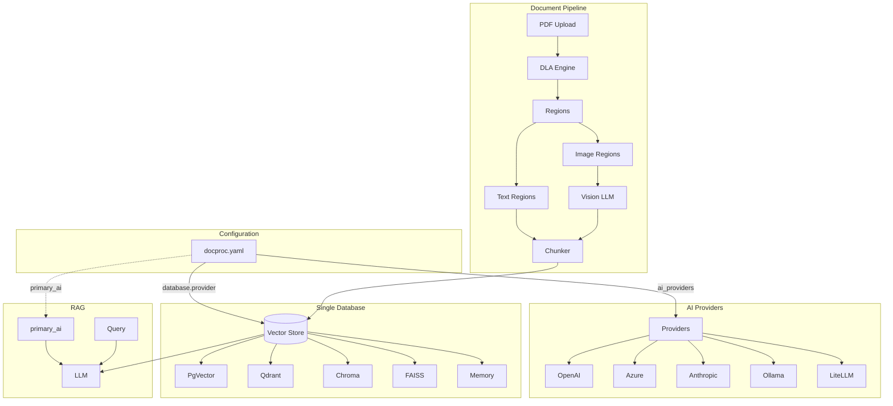

# Docproc

Document Intelligence Platform: ML-based layout analysis, vision LLM extraction, config-driven RAG.

## Motivation

I learn by asking questions. Not surface-level ones. The deep, obsessive "why"s that most materials never bother to answer. When my peers were studying from slides and PDFs, I sat there stuck. I couldn't absorb content I wasn't allowed to interrogate. My GPA tanked. Documents don't talk back. They don't explain the intuition, the connections, the *why*. I felt like everyone else had a way in, and I was just different. Tools like NotebookLM couldn't help either. They don't understand images inside the data source, so those parts just show up blank. Most of my slides were visual or text as screenshots. I was left with nothing.

So I built something for myself. A library that extracts content from any document, slides, papers, textbooks, whatever, and lets me use AI to actually ask. *Why does this work? What's the reasoning here? How does this connect to that thing from last week?* For the first time, static documents became something I could learn from. Not by re-reading. By *conversing*.

I'm open-sourcing it because I'm probably not the only one who learns this way. If you've ever felt frustrated by materials that assume you'll just "get it," or if you need to poke and prod before it clicks, this is for you. I don't think knowledge should be locked behind formats that only work for some kinds of learners. Docproc is my attempt to change that.

## Overview

Docproc v2 provides:

- **90%+ region analysis** — LayoutLMv3-based Document Layout Analysis (DLA)
- **Vision LLM extraction** — all images routed to GPT-4o, Claude, LLaVA, etc.
- **Config-driven** — single source of truth in `docproc.yaml`; one database, multiple AI providers
- **Database options** — PgVector, Qdrant, Chroma, FAISS, or in-memory
- **AI providers** — OpenAI, Azure, Anthropic, Ollama, LiteLLM
- **RAG** — Apple CLaRa or embedding-based
- **API & frontend** — FastAPI, Streamlit, Open WebUI compatible

## Architecture


```mermaid
flowchart TB
    subgraph Config [Configuration]
        YAML[docproc.yaml]
    end

    subgraph DB [Single Database]
        YAML -->|"database.provider"| Store[(Vector Store)]
        Store --> PgVector[PgVector]
        Store --> Qdrant[Qdrant]
        Store --> Chroma[Chroma]
        Store --> FAISS[FAISS]
        Store --> Memory[Memory]
    end

    subgraph AI [AI Providers]
        YAML -->|"ai_providers"| Providers
        Providers --> OpenAI[OpenAI]
        Providers --> Azure[Azure]
        Providers --> Anthropic[Anthropic]
        Providers --> Ollama[Ollama]
        Providers --> LiteLLM[LiteLLM]
    end

    subgraph Pipeline [Document Pipeline]
        PDF[PDF Upload] --> DLA[DLA Engine]
        DLA --> Regions[Regions]
        Regions --> Text[Text Regions]
        Regions --> Images[Image Regions]
        Images --> Vision[Vision LLM]
        Text --> Chunker[Chunker]
        Vision --> Chunker
    end

    subgraph RAG [RAG]
        Chunker --> Store
        Primary[primary_ai] --> LLM[LLM]
        Store --> LLM
        Query[Query] --> LLM
    end

    YAML -.->|"primary_ai"| Primary
```

**Single source of truth:** `docproc.yaml` selects one database and one primary AI provider. Multiple AI providers can be configured; only the primary is used for RAG by default.

## Quick Start

```bash
# 1. Copy example config
cp docproc.example.yaml docproc.yaml

# 2. Edit docproc.yaml: pick database + AI provider
# database.provider: qdrant | pgvector | chroma | faiss | memory
# primary_ai: openai | anthropic | ollama | litellm

# 3. Start services (e.g. Qdrant)
docker run -p 6333:6333 qdrant/qdrant

# 4. Run API
docproc-serve
```

## Configuration

Create `docproc.yaml` (see [docs/CONFIGURATION.md](docs/CONFIGURATION.md)):

```yaml
database:
  provider: qdrant  # one of: pgvector, qdrant, chroma, faiss, memory
  connection_string: http://localhost:6333

ai_providers:
  - provider: openai
  - provider: anthropic

primary_ai: openai

rag:
  backend: embedding  # embedding | clara
  top_k: 5
```

## Installation

```bash
uv sync --python 3.12
```

## Usage

### API

```bash
DOCPROC_CONFIG=docproc.yaml docproc-serve
```

### CLI

```bash
docproc --file input.pdf -w csv -o output.csv
```

### Frontend

```bash
uv run streamlit run frontend/app.py
```

### Docker

**Standalone image (memory DB, no external services):**
```bash
docker build -t docproc:2.0 .
docker run -p 8000:8000 -e OPENAI_API_KEY=sk-xxx docproc:2.0
```

**With Postgres + Qdrant:**
```bash
cp docproc.example.yaml docproc.yaml
# Edit docproc.yaml: database.provider: qdrant
docker-compose up
```

### Library

```python
from docproc.config import load_config, get_config
from docproc.stores.factory import create_store
from docproc.providers.factory import get_provider

load_config("docproc.yaml")
store = create_store()  # single DB from config
provider = get_provider()  # primary AI from config
```

### Open WebUI

Point Open WebUI to `http://localhost:8000/api` for OpenAI-compatible chat.

## Documentation

- [Configuration Guide](docs/CONFIGURATION.md) — schema, database options, AI providers

## Contributing

Pull requests welcome. Ensure tests pass.

## Contact

[hi@rithul.dev](mailto:hi@rithul.dev)
